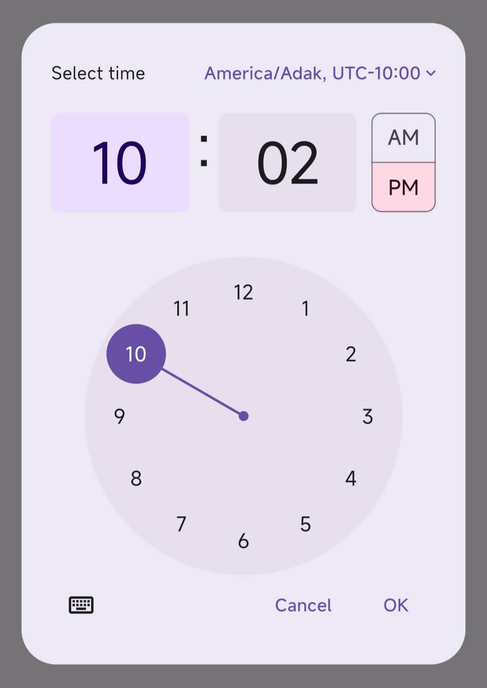
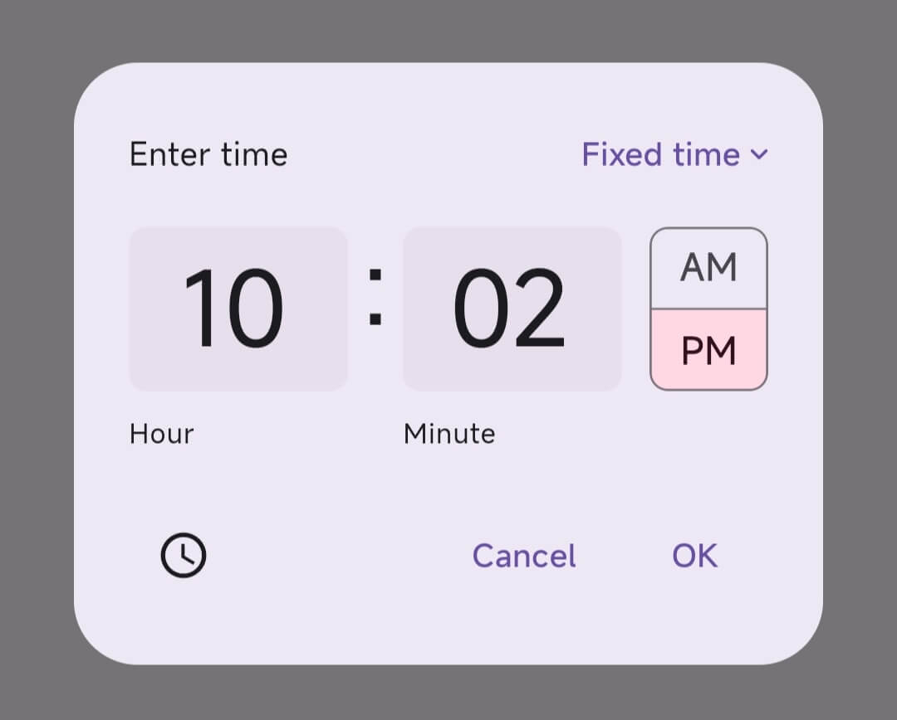
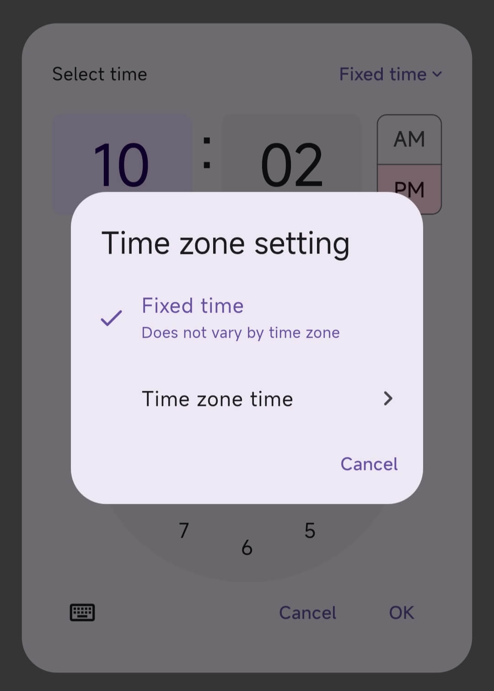
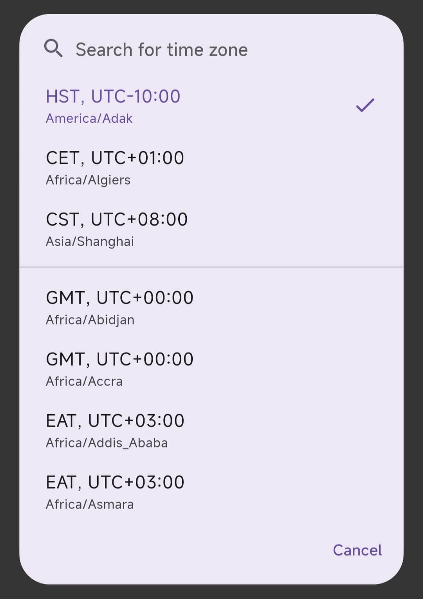

# AnimatedToggleSwitch

[](https://pub.dev/packages/time_picker_with_timezone)
[](https://github.com/lijianqiang12/time_picker_with_timezone)
[](https://pub.dev/packages/time_picker_with_timezone/score)
[](https://pub.dev/packages/time_picker_with_timezone/score)
[](https://pub.dev/packages/time_picker_with_timezone/score)
[](https://github.com/lijianqiang12/time_picker_with_timezone/blob/master/LICENSE)
<!-- [](https://codecov.io/gh/lijianqiang12/time_picker_with_timezone) -->

[](https://www.buymeacoffee.com/lijianqiang12)


### 如果喜欢这个库, 欢迎点赞 [pub.dev](https://pub.dev/packages/time_picker_with_timezone) 或 [GitHub](https://github.com/lijianqiang12/time_picker_with_timezone).


## 功能

在Flutter官方time_picker组件上添加时区选择功能

## Screenshots
{width=400 height=560}
{width=400 height=320}
{width=400 height=560}
{width=400 height=560}


## 开始

```shell
flutter pub add time_picker_with_timezone
```

## 使用

```dart
showCustomTimePicker(
    context: context,
    initialTime: TimeOfDay.now(),
    // enableTimeZone: true,
    // timeZoneShowType: TimeZoneShowType.nameAndOffset,
    // initTimeZoneType: TimeZoneType.fixedTime,
    // initTimeZoneData: const TimeZoneData(name: "Asia/Shanghai", abbreviation: "CST", offset: 8, isDst: false),
    // customTimeZoneDataList: const [
    //   TimeZoneData(name: "Asia/Shanghai", abbreviation: "CST", offset: 8, isDst: false),
    //   TimeZoneData(name: "Africa/Algiers", abbreviation: "CET", offset: 1, isDst: false),
    //   TimeZoneData(name: "America/Adak", abbreviation: "HST", offset: -10, isDst: false),
    // ],
    // timeZoneHelpIcon: const Icon(Icons.help),
    // timeZoneHelpPressed: () {
    //   print('timeZoneHelpPressed');
    // },
    // timeZoneTypeTitle: "时区设置",
    // fixedTimeTitle: "固定时间",
    // fixedTimeSubTitle: "时间不随时区变化",
    // timeZoneTimeTitle: "时区时间",
    // timeZoneSearchIcon: const Icon(Icons.search_rounded),
    // timeZoneSearchHint: "搜索时区",
    // timeZoneSearchHintStyle: const TextStyle(fontSize: 16),
    // removeFromHistoryTitle: "移除历史记录",
    // removeFromHistoryContent: "移除该条历史记录后，置顶将取消。",
).then((timeWithTimeZone) {
    print(timeWithTimeZone);
});
```

## 关于我

- [Charles Lee](https://github.com/lijianqiang12)

## 支持

  - 如果喜欢这个库, 欢迎点赞 [pub.dev](https://pub.dev/packages/time_picker_with_timezone) 或 [GitHub](https://github.com/lijianqiang12/time_picker_with_timezone).

## License

- 使用时请遵循 [BSD 3-Clause License](https://github.com/lijianqiang12/time_picker_with_timezone/blob/master/LICENSE)
